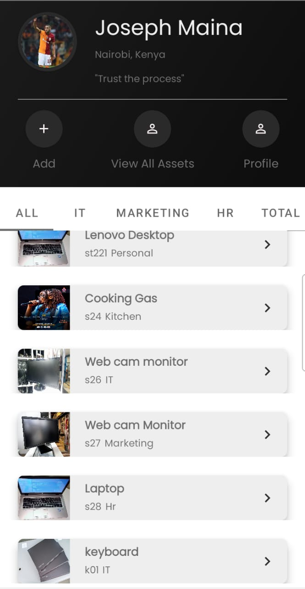
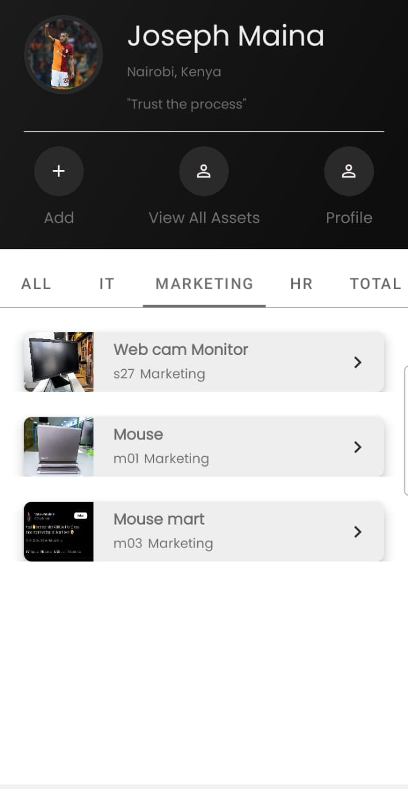
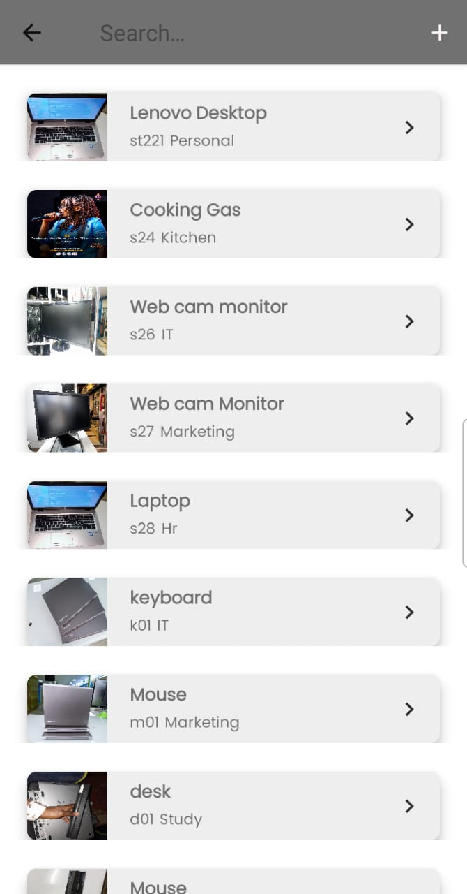
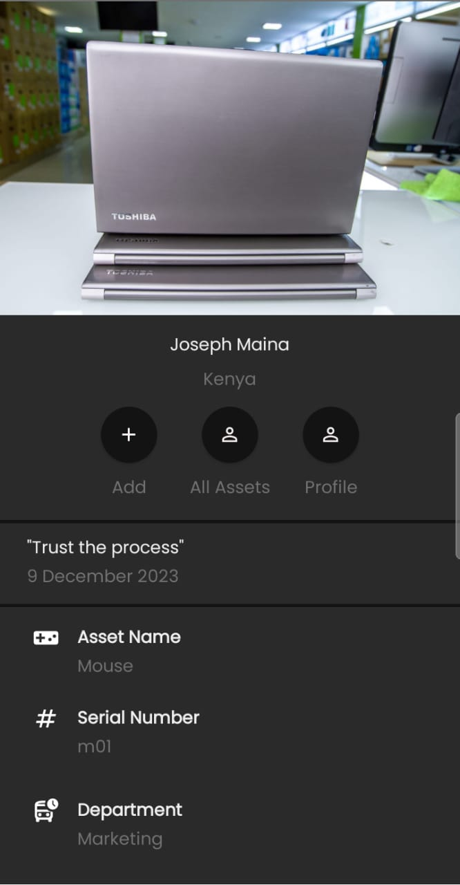
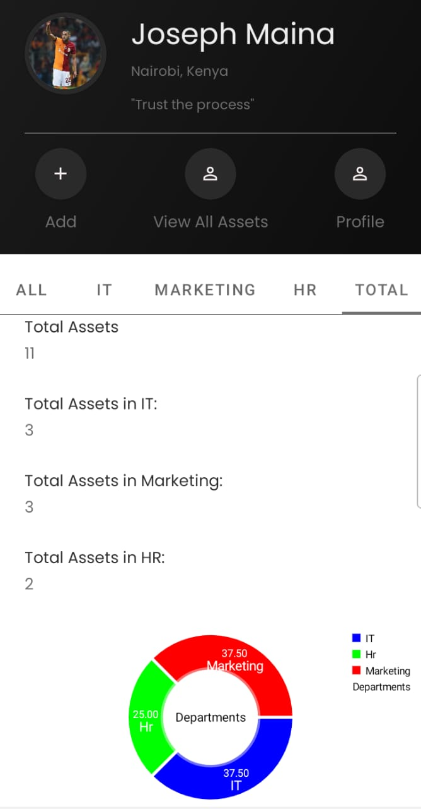
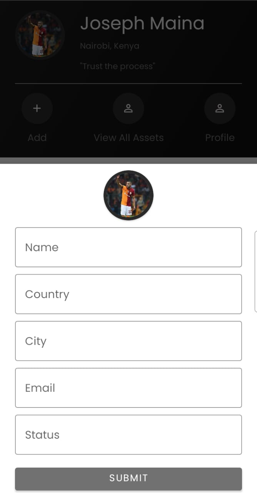

# Asset Management App

## Description
Welcome to the Asset Management Android App! This application is designed to streamline the management of assets, providing a user-friendly interface to perform various operations. Whether you need to add new assets, categorize them by department, search for specific assets, view detailed information, or track the total count of assets, this app has you covered.

# Features
* Add New Assets
Easily add new assets to the system with a few simple steps. Specify crucial details and categorize assets by department for efficient management.

* Department-wise Asset Display
View assets categorized by departments, making it convenient to assess and manage assets within specific organizational units.

* Search Functionality
Effortlessly search for specific assets using the search functionality. Find what you need quickly and efficiently.

* Asset Details
Access comprehensive details about each asset, ensuring you have all the information you need at your fingertips.

* Total Asset Count
Get an overview of the total count of assets, providing valuable insights into the overall asset portfolio.

* User Profile
Tailor your experience by managing your user profile. Keep your information up-to-date and personalized.

## How to Use
* Add New Assets:
Navigate to the "Add New Assets" section.
Fill in the required details for each asset.
Specify the department to which the asset belongs.

* Department-wise Display:
Explore the app to view assets categorized by different departments.
Gain a clear understanding of asset distribution within your organization.

* Search Functionality:
Use the search functionality to find specific assets quickly.
Enter keywords or details to narrow down your search.

* Asset Details:
Click on individual assets to access detailed information.

* Total Asset Count:
Check the total count of assets on the dashboard.
Get a quick overview of your organization's asset landscape.

* User Profile:
Personalize your experience by managing your user profile.
Update information and settings as needed.
Installation
Clone the repository to your local machine.

Copy code
git clone https://github.com/your-username/asset-management-app.git
Open the project in Android Studio.

Build and run the application on your Android device or emulator.

Contributing
We welcome contributions! If you find issues or have suggestions for improvements, please open an issue or submit a pull request.

#### By **[JOSEPH MAINA](https://github.com/JMDev2)**

## Technologies Used
* Multi-Modular Application
* MVVM Architecture
* Kotlin
* Room Database
* Coroutines
* Dagger2
* Search functionality

### License

MIT License
Permission is hereby granted, free of charge, to any person obtaining a copy
of this software and associated documentation files (the "Software"), to deal
in the Software without restriction, including without limitation the rights
to use, copy, modify, merge, publish, distribute, sublicense, and/or sell
copies of the Software, and to permit persons to whom the Software is
furnished to do so, subject to the following conditions:

The above copyright notice and this permission notice shall be included in all
copies or substantial portions of the Software.

THE SOFTWARE IS PROVIDED "AS IS", WITHOUT WARRANTY OF ANY KIND, EXPRESS OR
IMPLIED, INCLUDING BUT NOT LIMITED TO THE WARRANTIES OF MERCHANTABILITY,
FITNESS FOR A PARTICULAR PURPOSE AND NONINFRINGEMENT. IN NO EVENT SHALL THE
AUTHORS OR COPYRIGHT HOLDERS BE LIABLE FOR ANY CLAIM, DAMAGES OR OTHER
LIABILITY, WHETHER IN AN ACTION OF CONTRACT, TORT OR OTHERWISE, ARISING FROM,
OUT OF OR IN CONNECTION WITH THE SOFTWARE OR THE USE OR OTHER DEALINGS IN THE
SOFTWARE. 

Copyright (c) 2023 **[JOSEPH MAINA](https://github.com/JMDev2)**
